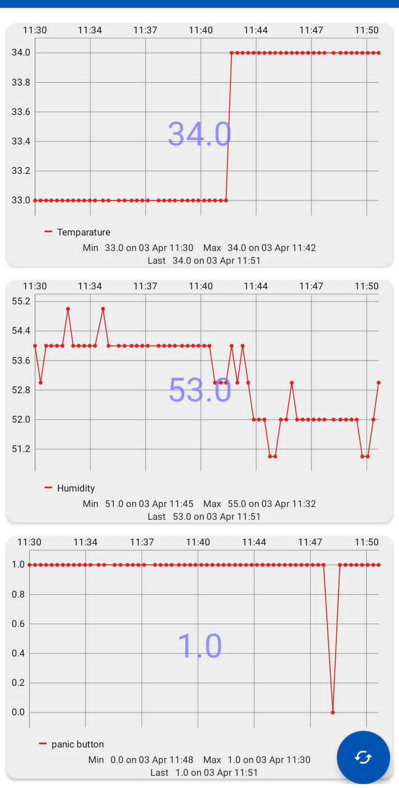
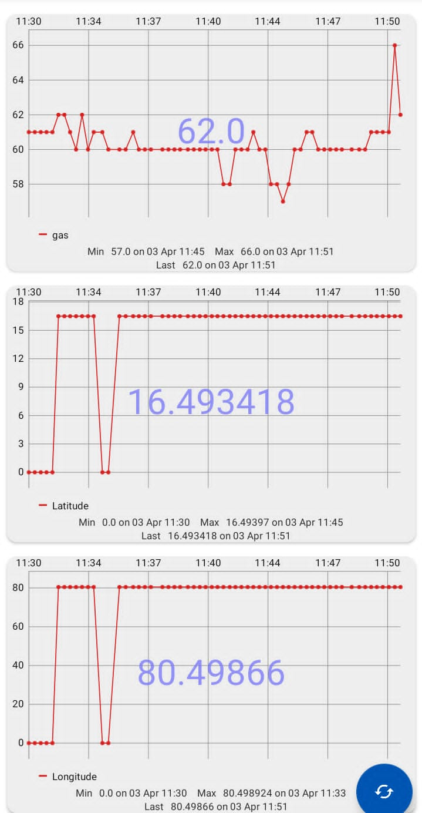
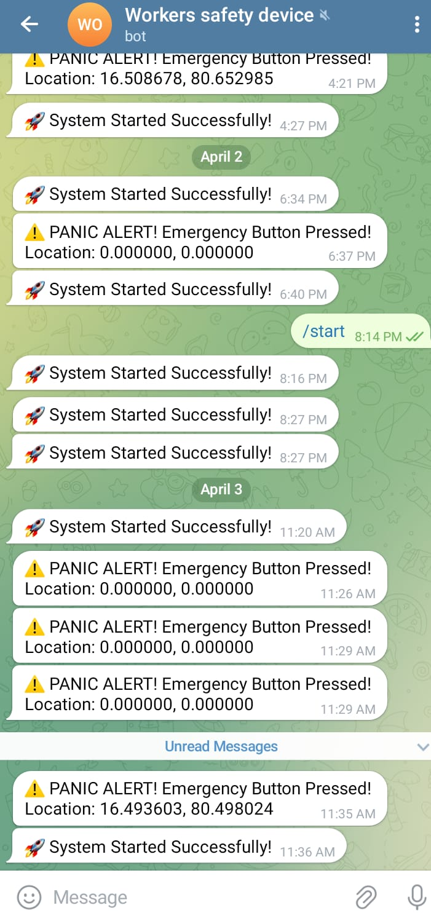

# IoT Worker Safety Monitoring System

## Overview

This project is an IoT-based Worker Safety Monitoring System developed using the ESP8266 (NodeMCU). It monitors temperature, humidity, gas concentration, and emergency button status in real time. Sensor data is uploaded to ThingSpeak, while emergency notifications with GPS coordinates are sent through a Telegram Bot.

## Features

- Real-time temperature monitoring
- Humidity monitoring
- Gas leakage detection
- Emergency panic button
- GPS location tracking
- Telegram notifications
- ThingSpeak cloud monitoring
- LCD display for sensor readings
- Buzzer-based emergency alert

## Hardware Components

- ESP8266 NodeMCU
- DHT11 Temperature & Humidity Sensor
- MQ Gas Sensor
- NEO-6M GPS Module
- 16×2 I2C LCD
- Push Button
- Buzzer
- Breadboard and Jumper Wires

## Software and Technologies

- Arduino IDE
- C++
- ThingSpeak
- Telegram Bot API
- ESP8266WiFi Library
- TinyGPS Library

## Working Principle

1. The ESP8266 collects data from the DHT11, MQ Gas Sensor, Panic Button, and GPS module.
2. Sensor readings are displayed on the LCD.
3. The collected data is uploaded to ThingSpeak for real-time monitoring.
4. If the gas concentration exceeds the threshold or the panic button is pressed:
   - The buzzer is activated.
   - A Telegram alert containing the GPS location is sent.
5. Supervisors can monitor workers remotely using the cloud dashboard and Telegram notifications.

## Project Screenshots

### ThingSpeak Dashboard





### Telegram Alert



## Project Structure

```
IoT-Worker-Safety-Monitoring-System/
│
├── WorkerSafetySystem.ino
├── dashboard1.jpg.jpeg
├── dashboard2.jpg.jpeg
├── telegram_alert.jpg.jpeg
├── README.md
└── LICENSE
```

## Future Improvements

- Firebase integration
- Mobile application
- SMS notification support
- OLED display
- AI-based hazard prediction

## Developer

**GitHub:** MonaV7
